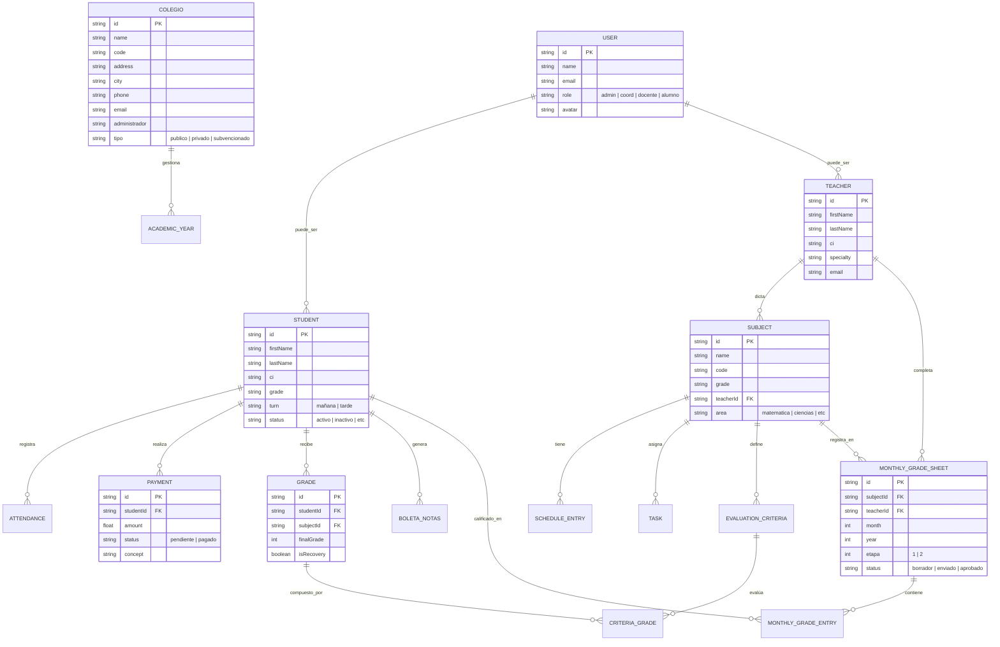

# Modelo de Datos - Sistema de Gestión Académica

Este documento detalla la estructura de la base de datos (NoSQL / Firestore) del sistema, organizada por módulos funcionales. El diseño sigue una arquitectura modular para facilitar la escalabilidad y el mantenimiento.

## 1. Diagrama de Entidad-Relación (ERD)

A continuación se presenta la visualización de las colecciones y sus relaciones. 

---

## 2. Definición de Módulos

### 🔵 Módulo de Administración (Core)
Controla la configuración global del establecimiento y los usuarios del sistema.
*   **Colegio:** Información institucional.
*   **User:** Cuentas de acceso con roles definidos (`administrador`, `coordinador`, `docente`, `alumno`).
*   **AcademicYear:** Define el ciclo escolar actual y las fechas de las etapas.

### 🟢 Módulo Académico
Estructura la carga horaria y las asignaciones pedagógicas.
*   **Teacher:** Perfil profesional del docente.
*   **Subject:** Materias asignadas a grados y docentes específicos.
*   **ScheduleEntry:** Horarios de clase por asignatura y aula.
*   **Task:** Tareas y proyectos asignados por los docentes.

### 🟠 Módulo del Estudiante
Gestión técnica y financiera del alumnado.
*   **Student:** Datos personales, académicos y de contacto (padres).
*   **Attendance:** Control diario de presencia por materia.
*   **Payment:** Historial de mensualidades, matrículas y otros conceptos.

### 🔴 Módulo de Evaluación (Foco Principal)
El motor de calificaciones y reportes del sistema.
*   **MonthlyGradeSheet:** Planilla mensual donde el docente carga los puntos.
*   **EvaluationCriteria:** Criterios específicos (Trabajo, Examen, etc.) para cada materia.
*   **Grade:** Registro final de calificaciones por etapa y recuperación.
*   **BoletaNotas:** Reporte consolidado de rendimiento y conducta.

---

## 3. Consideraciones Técnicas (Firestore)

A diferencia de un modelo SQL tradicional, este sistema aprovecha las capacidades de Firestore:
1.  **Referencias Directas:** Se utilizan IDs de documentos para simular relaciones Foreign Key.
2.  **Subcolecciones y Objetos Anidados:** Por ejemplo, `MonthlyGradeSheet` contiene un array de `entries` para optimizar la lectura de planillas completas.
3.  **Seguridad por Roles:** Las reglas de Firebase (`firestore.rules`) utilizan el campo `role` del documento `User` para restringir el acceso a colecciones sensibles como `Payment` o `Grade`.

> [!TIP]
> Para extender el modelo (ej. añadir un módulo de Biblioteca), se recomienda seguir el patrón de **Normalización Híbrida**: mantener datos pequeños anidados y datos grandes en colecciones independientes.
